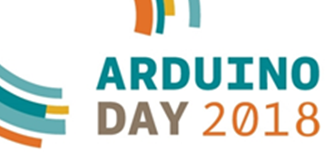
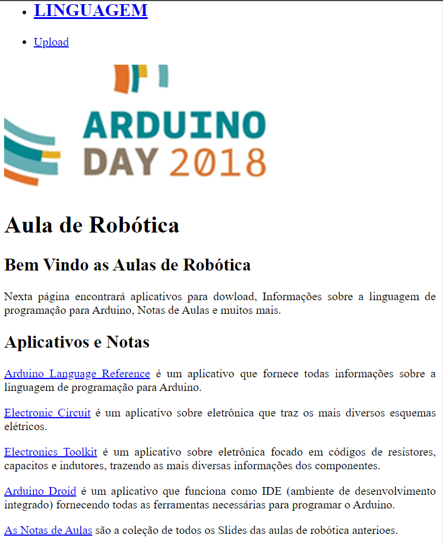
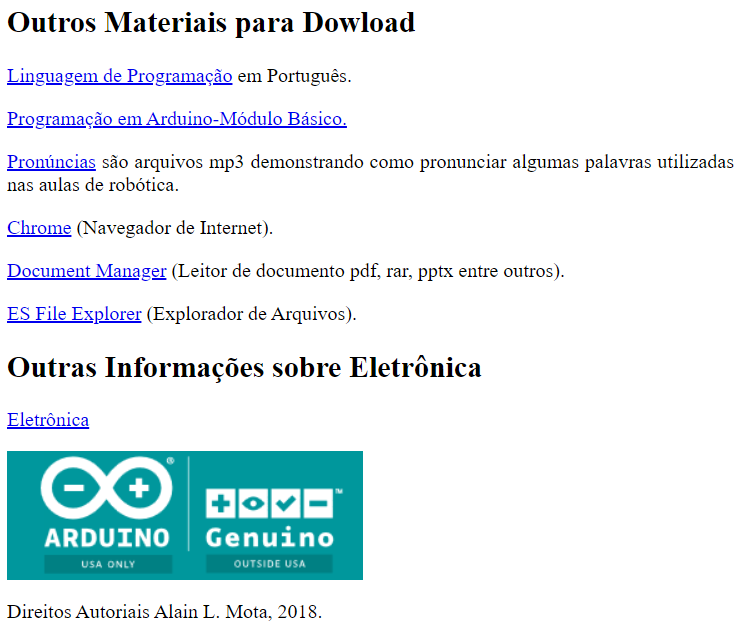
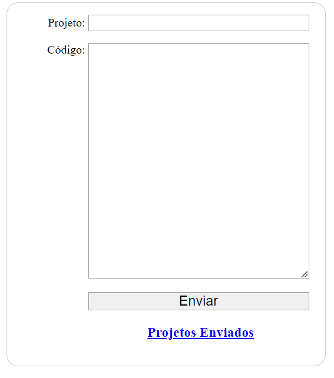
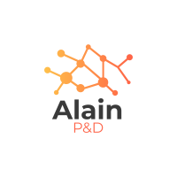

# Servidor_Robotica

Neste projeto foi construída um pagina web num servidor local na qual permite que os alunos enviem seus programas desenvolvidos em liguagem C++, para que todos testem suas aplicações em um mesmo projeto na plataforma Arduino.

### Tecnologia
Aqui estão as tecnologias utilizadas neste projeto.

* Ardunino Uno
* Xampp
* PHP
  

### Serviços Usados
* Arduino IDE
  

### Plataforma compatíveis
* Android

### Situação do Projeto
Projeto já foi encerrado

### Interface

### Recursos
* Auxilia ao aluno buscar informações na página offline através do servidor local
* Possibilita que os alunos postem suas aplicações para testes
* Permite realizar dowload de programas apk para android necessários para realização das atividades

### Links
* [Repository](https://github.com/AlainMota9/Servidor_Robotica)
* [Facebook](https://www.facebook.com/alain.mota.3/)
* [Lattes](http://lattes.cnpq.br/9940114103826916)
* [linkedin](https://www.linkedin.com/in/alain-mota-a61319117/)

### Controle de versão
1.0.0.0

### Autor
Alain L. Mota: [@AlainMota](https://github.com/AlainMota9)

#### Obrigado pela Visita!

